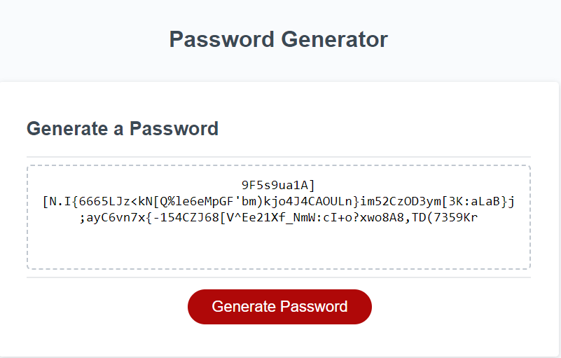

# Random Password Generator

 Password Generator
 
## Description

This program will ask you how long your password is (between 8 and 128 characters) and if you want to include lowercase, uppercase, symbols, and/or numbers in your password. It then provides you with a random output within those parameters.

### Preview Page

Page Link:[https://kylatae.github.io/password-generator/](https://kylatae.github.io/password-generator/) 

Repo Link:[https://www.github.com/kylatae/password-generator/](https://www.github.com/kylatae/password-generator/)

## Authors & Contributors 

Arthur Henningfield

## License

See repo

